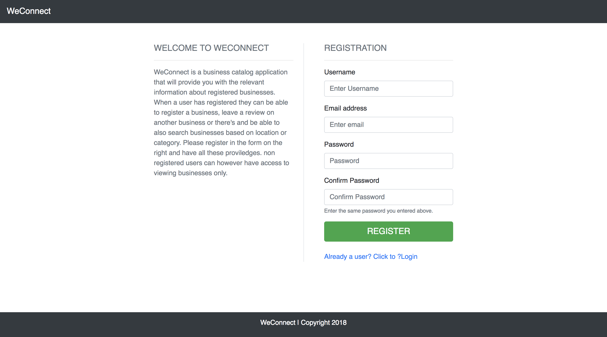
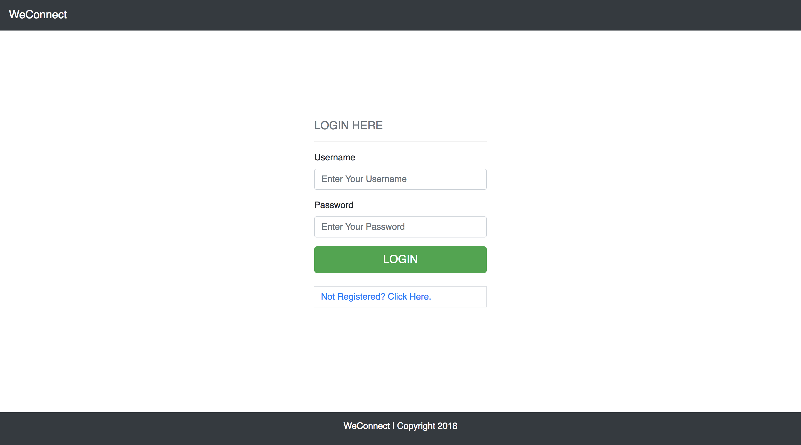

[](https://travis-ci.org/louiCoder/Weconnect-React-App)
[](https://coveralls.io/github/louiCoder/Weconnect-React-App?branch=develop)
# WE-CONNECT REACT APPLICATION

### About
This is a ReactJS Application, created using Facebook's create-react-app. The App consumes the  We-connect python/flask API developed previously.

### You can view the live demo on the link below
[Click this link view live demo of the react application in action](https://weconnect-react-app.herokuapp.com/)


### Instructions on setting up locally

- Create a directory with any name using command below
```
$ mkdir directory-name-here
```

- Navigate to that directory with the command below.
```
$ cd path/to/directory
```

- Clone this repository
```
git clone https://github.com/louiCoder/Weconnect-React-App.git
```

- Navigate to `src/helper/Url.js` or simply search for file `Url.js` and comment out the line with `export const BASE_URL = 'https://weconnect-api-app.herokuapp.com/'` and uncomment the line with `export const BASE_URL = 'http://127.0.0.1:5000/'`


- Install Required Packages
Make sure you have npm installed on your machine before running the command below
```
$ npm install
```

- Run the application with trhe command below
```
$ npm start
```

### Run application tests with the commands below
- To run all the tests normally
```
$ npm test
```
 - Run tests with Coverage
```
$ npm test -- --coverage
```

### Guidelines on navigation for first time users
- Register with a new account on the registration this can be accessed by entering `http://127.0.0.1:3000/register` to the url. Fields below are mandatory.
```
username, email and password
```
### Screenshot for registration page


- Log into the application by entering your username and password that you registered with previously the login page can be accessed by clicking `Already registered user` on the registration page or typing the url in your browser and clicking `Go` or pressing enter
```
http://127.0.0.1:3000/login
```

### Screenshot of how the login page looks like


### Other important links.

| ROUTE | DESCRIPTION | 
| ------- | ----- | 
| /register | New user registration | 
| /login | User login | 
| /business | New business registration | 
| /allbusinesses | All registered businesses (viewing businesses, reviewing businesses and viewing all reviews for a selected business) | 
| /mybusinesses | User's owned businesses (viewing, editing, adding reviews and viewing reviews of owned business, ) | 
| /search | Searching businesses | 
| /profile | User's profile and User's reset password section | 

> After succcessfully logging into the application, you can now navigate to different pages of your choice using the navigation menu on top of the page. The above table illustrates some of the places you can navigate to in the application.


```
Author - Musanje Louis Michael
```